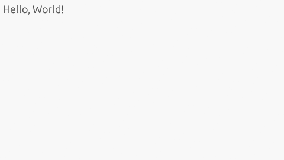
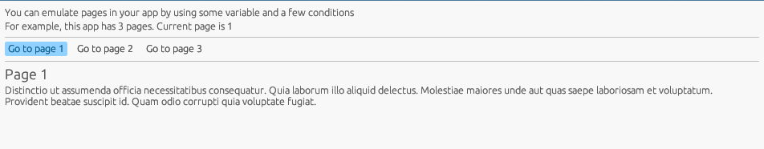
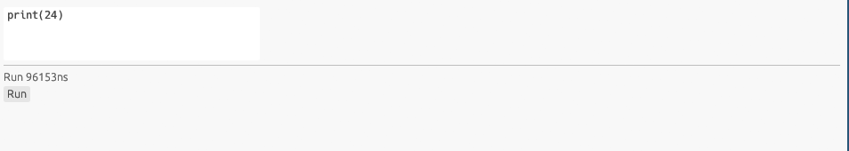
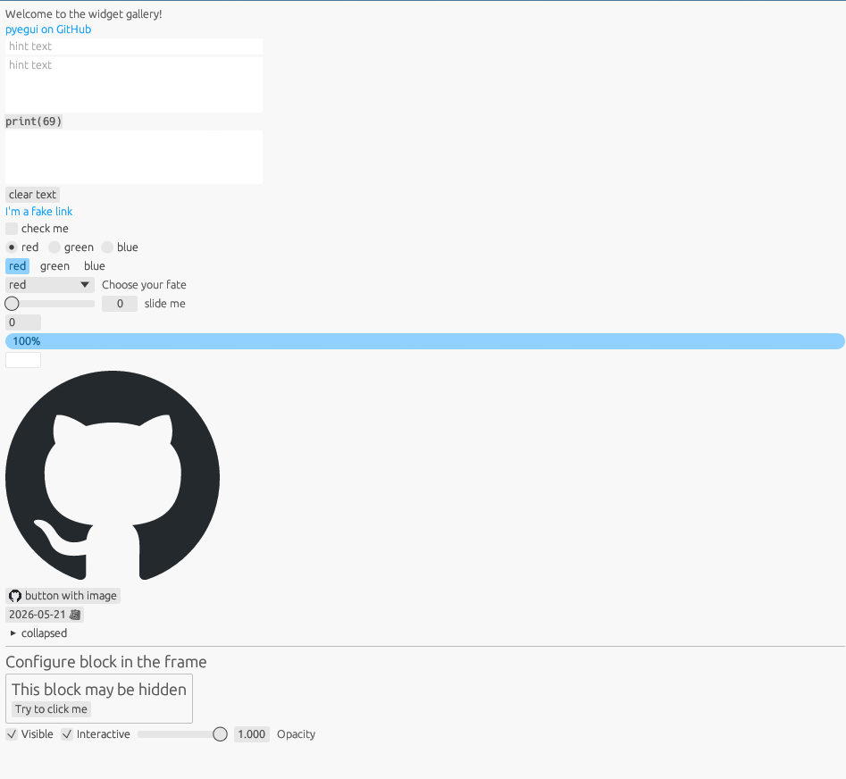

Examples
===========

hello world
-------------

.. literalinclude:: ../examples/hello_world.py
   :language: python
   :linenos:

pages
-------------

.. literalinclude:: ../examples/pages.py
   :language: python
   :linenos:

python IDE
-------------

.. literalinclude:: ../examples/python-ide.py
   :language: python
   :linenos:

all widgets
-------------

.. literalinclude:: ../examples/widget_gallery.py
   :language: python
   :linenos:

